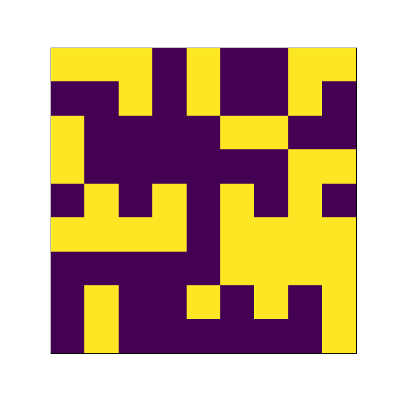

# Conway's Game of Life

A PEP-8 compliant implementation of Conway's Game of Life on a toroidal surface with support for argument parsing, in 37 lines of code.

## Usage
Run
```python conway.py --size 9 --frames 50 --wait 100``` to generate 50 frames on a board of size 9×9 with a 100 ms pause between frames.

## Examples
### Random: 
### Glider: 
### Blinker: 
### Out of Bounds: 